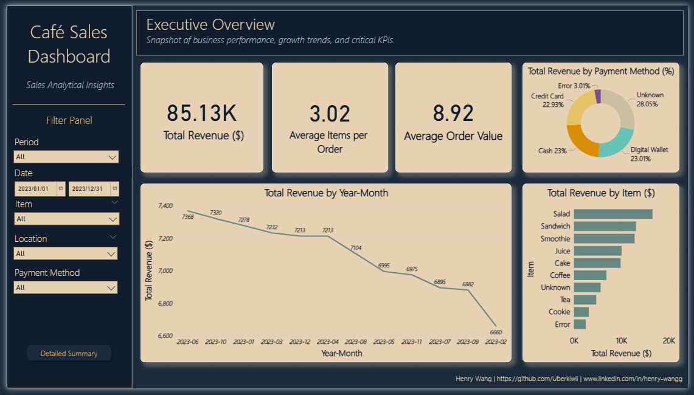
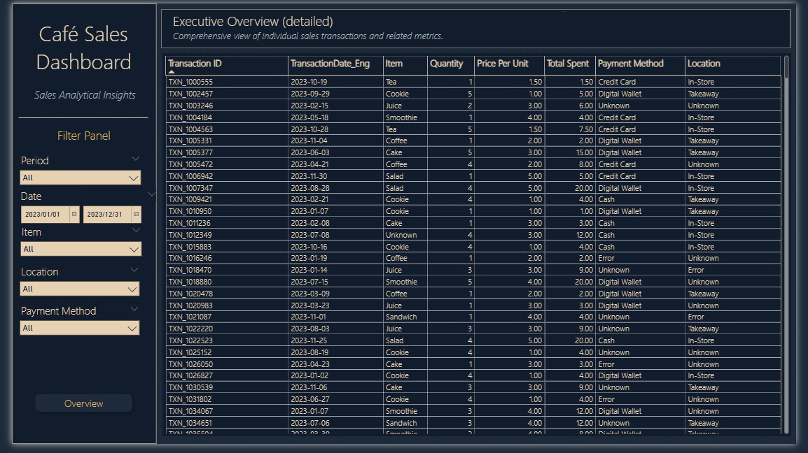

# Café Sales Data Cleaning, EDA & Power BI Dashboard  


Author
Henry Wang
Data Analyst | IT Graduate | Power BI Developer  
[](https://www.linkedin.com/in/henry-wangg)

Dataset: [Café Sales Dirty Data for Cleaning Training (Kaggle)](https://www.kaggle.com/datasets/ahmedmohamed2003/cafe-sales-dirty-data-for-cleaning-training/data)

---

## Overview
End-to-end analysis of a 2023 café transaction dataset (≈10 000 rows) from raw data cleaning to exploratory analysis and dashboard visualization.  
The goal was to produce a validated, analysis-ready dataset and develop a Power BI dashboard highlighting key sales, product, and customer insights.

---

## Objectives
- Clean and standardize raw café transaction data for accuracy.  
- Analyze revenue, order value, and customer behavior patterns.  
- Visualize results in an interactive Power BI dashboard.  

---

## Data Preparation (Summary)
- Inspected and converted data types for numeric and date fields.  
- Replaced nulls in categorical fields with **“Unknown”** / **“Error.”**  
- Re-computed missing numeric values using arithmetic logic  
  (*Total Spent = Quantity × Price Per Unit*).  
- Removed invalid dates (< 5 %) and validated > 99 % arithmetic consistency.  
- Exported final dataset as `cleaned_cafe_sales.csv` for analysis.

---

## Tools & Technologies
| Category | Tools |
|-----------|-------|
| Language | Python |
| Libraries | Pandas, NumPy, Matplotlib, Seaborn |
| Visualization | Power BI Desktop |
| Environment | Jupyter Notebook |

---

## Exploratory Data Analysis
**Dataset:** 9 540 transactions  
**Period:** January – December 2023  

**Highlights**
- Spending distribution is right-skewed; most transactions under $15.  
- **Sandwiches, Smoothies, Coffee** generate the highest total revenue.  
- **Digital Wallet** / **Credit Card** users spend more per order than cash users.  
- **Takeaway** orders have higher average ticket values than in-store purchases.  
- Revenue remains stable year-round with peaks in **May–June** and **October–December**.  

**Core EDA Outputs**
- Item and payment-method frequency distributions  
- Top 10 items by revenue  
- Average spending by payment method and location  
- Monthly and weekday revenue trends  
- Heatmap – average spend by month × day of week  

---

## KPI Summary (2023)
| Metric | Value |
|--------|--------|
| Total Revenue | ≈ $85 000 |  
| Average Order Value | $8.9 |  
| Average Items per Order | 3.0 |  
| Top Item by Revenue | Sandwich |  
| Common Payment Method | Digital Wallet |  

---

## Power BI Dashboard
The interactive dashboard consolidates cleaning and EDA insights into three main views:  

1. **Executive Overview** – Top KPIs and revenue trends  
2. **Filter Panel** – Dynamic slicers for date, item, location, payment method
3. **Navigation Button** - Working button for navigation between overviews
4. **Detailed Transaction View** – Row-level sales records for drill-down analysis
   
  
  

---

## Key Insights
- Café revenue driven primarily by **Sandwiches, Smoothies, Coffee**.  
- **Takeaway** transactions yield higher average spend per order.  
- **Digital payment** users display higher spending and loyalty potential.  
- Consistent weekday revenue supports reliable staffing and inventory planning.  

---

## Strategic Recommendations
- Introduce combo promotions (e.g., Sandwich + Coffee) to raise ticket size.  
- Offer digital-payment incentives to reduce checkout time and encourage loyalty.  
- Optimize weekend staffing and supply based on higher takeaway demand.  
- Reassess low-volume menu items for potential rotation or promotion.  

---

## How to Run
```bash
git clone https://github.com/yourusername/cafe-sales-analysis.git
cd cafe-sales-analysis
pip install pandas numpy matplotlib seaborn jupyter
jupyter notebook Cafe_EDA.ipynb

Then open the Power BI file (cafe_sales_dashboard.pbit) and connect it to cleaned_cafe_sales.csv.
```
---

